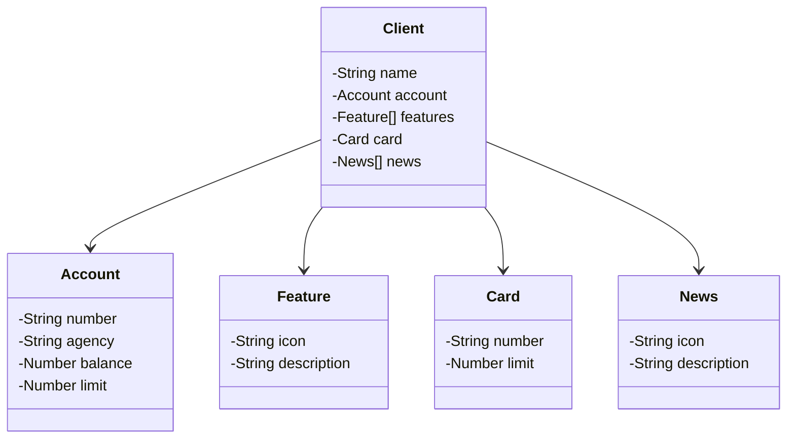

## Projeto Final Bootcamp Santander 2023 Angular + Java
Último projeto do Bootcamp Santander 2023 - Publicação de uma API RESTful na Nuvem utilizando Spring Boot 3 e Railway

# Diagrama de Classes

